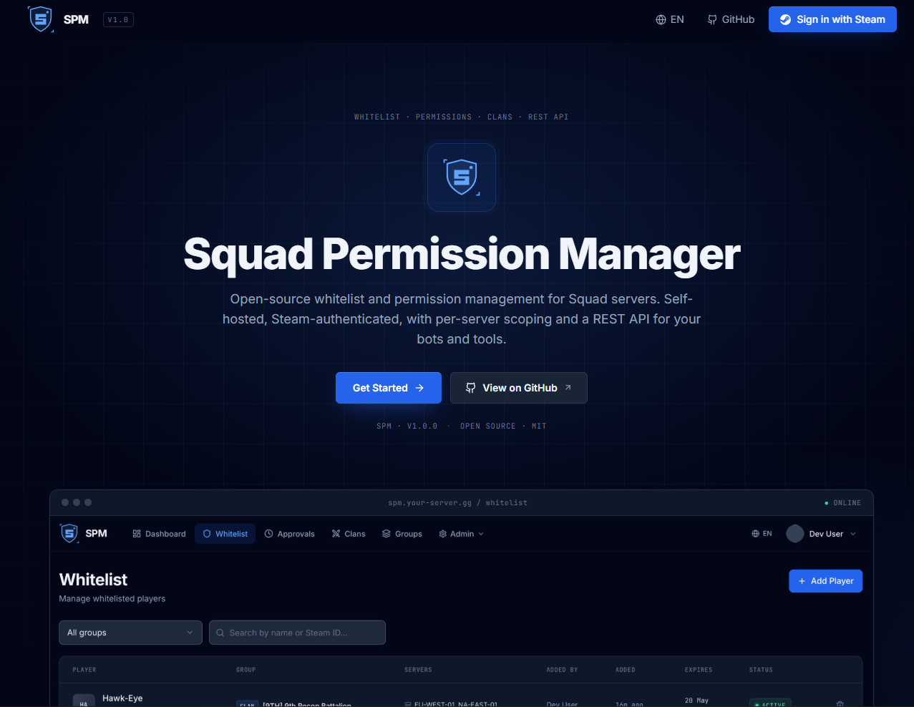
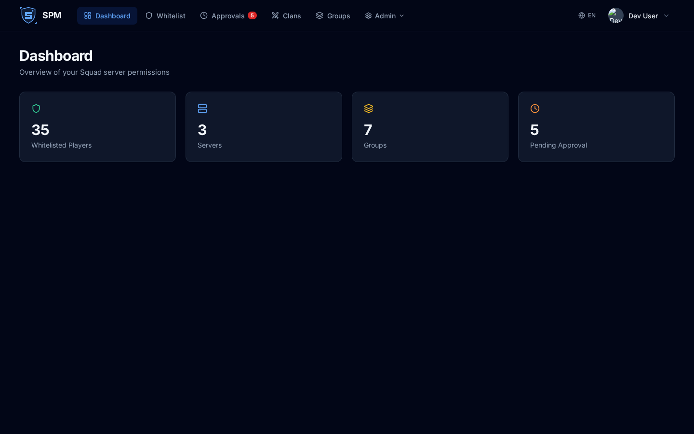
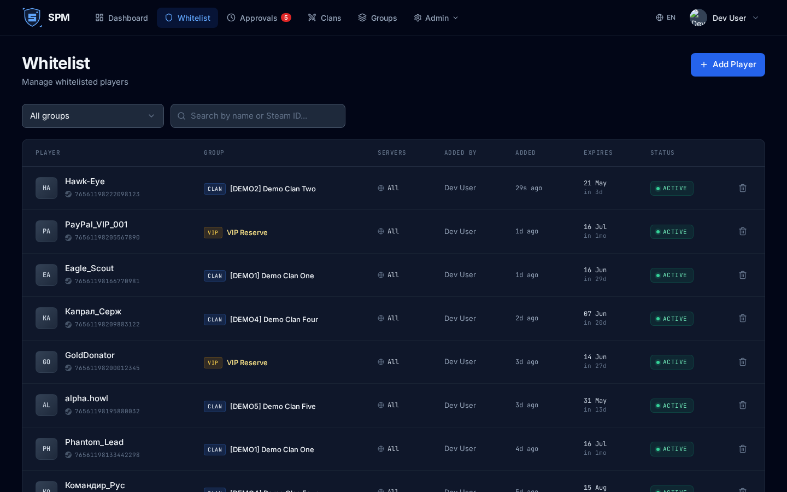
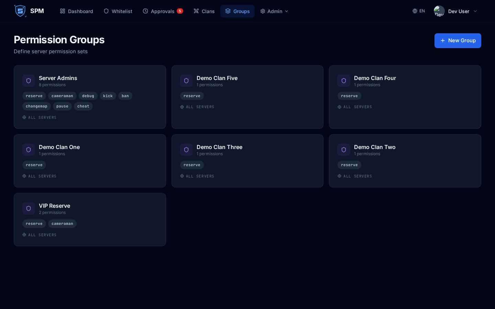
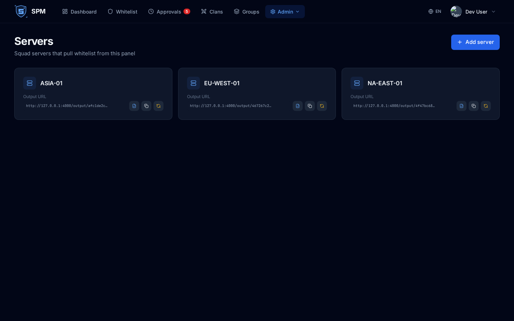
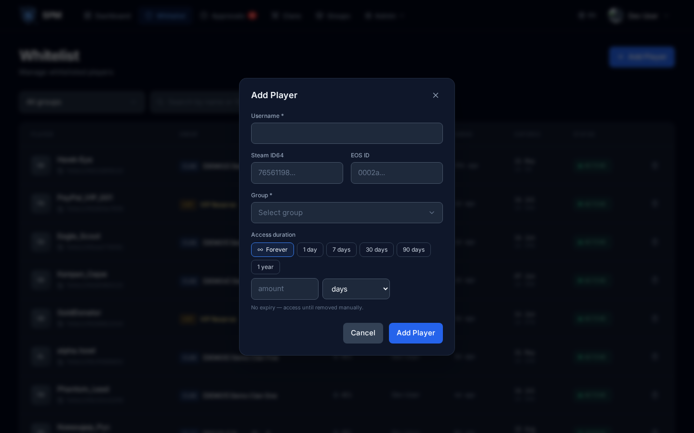
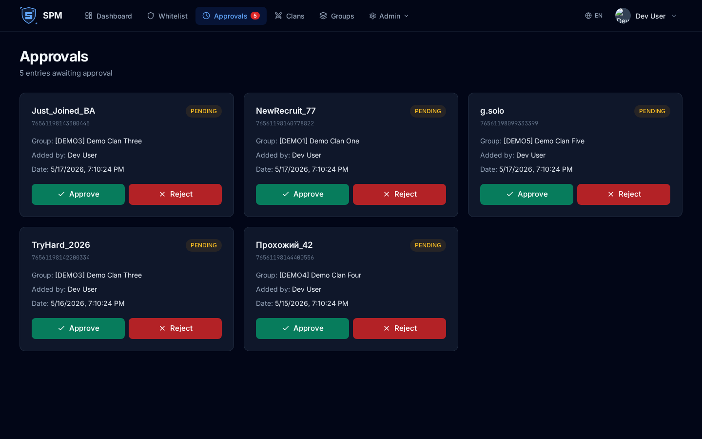
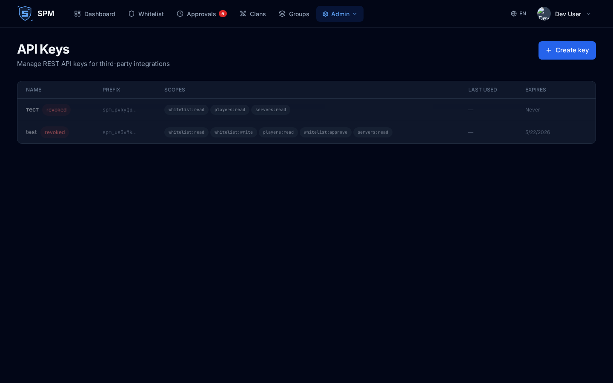

# SquadPermissionManager

Self-hosted web panel for managing whitelists and admin permissions on **Squad** servers. A single interface for multiple servers and organizations, Steam-based authentication, an optional Discord bot for approving pending entries, and a public REST API for integrations (donation bots, monitoring, custom tools).

Each Squad server pulls its own personal INI through `RemoteAdminListHosts.cfg` — the panel serves exactly the groups that apply to that server.





---

## Contents

- [Features](#features)
- [Architecture](#architecture)
- [Tech stack](#tech-stack)
- [Installation](#installation) — full step-by-step from a blank VPS
- [Configuration (.env)](#configuration-env)
- [Connecting a Squad server](#connecting-a-squad-server)
- [Discord bot](#discord-bot)
- [Public REST API](#public-rest-api)
- [Updating](#updating)
- [Baseline admin (for forks)](#baseline-admin-for-forks)
- [Security](#security)
- [License](#license)

---

## Features

**Access management**
- Four group types: `clan`, `vip`, `admin`, `custom`. Each carries an arbitrary set of Squad permissions (`reserve`, `cameraman`, `debug`, …).
- Whitelist entries: player (Steam ID64 or EOS ID) ⇄ group, with an optional expiry.
- Group-to-server binding: `serverScope: "all"` (every server in the organization) or an explicit list of servers.
- Per-group player limit (`playerLimit`).
- Optional **requires approval** mode (`requireApproval`) — entries land in pending until a moderator confirms them (via UI or Discord button).
- A cron job every 5 minutes removes expired entries and busts the INI cache.



Permission groups define which Squad permissions get granted and which servers they apply to:



**Multi-server and multi-organization**
- Multiple Squad servers per installation.
- Multiple organizations, each with its own servers / groups / users.
- Each Squad server has its own secret token in the output URL (`/output/<slug>/<token>` or `/output/<token>`).
- Per-server `preferEosId` toggle — writes EOS ID instead of Steam ID64 in the INI.



**Roles and authentication**
- Login via **Steam OpenID** (passport-steam) — no passwords stored.
- System roles: `owner`, `admin`, `manager`.
- Per-organization access levels: `owner` / `admin` / `moderator` / `viewer` — every operation is scoped to the current org.
- Per-group clan managers (`managers` — array of Steam ID64): not panel admins, but can add/remove players in their clan within `playerLimit`. Whether their entries auto-approve or wait for review is controlled by the group's `requireApproval` flag — same rule applies to admins.
- JWT (access 15m + refresh 7d), refresh token in an httpOnly cookie.

**Clans**
- Separate entity for grouping whitelist slots.
- Clan managers get a UI to self-service their roster.

**Discord integration (optional)**
- The bot posts an embed notification for every new pending entry with **Approve / Reject** buttons.
- The notification is sent only when `DISCORD_APPROVER_ROLE_ID` is configured (fail-closed — no point posting buttons no one is allowed to click).
- Button clicks are gated by membership in that role, verified live via `guild.members.fetch`.
- The bot's guilds/channels/roles are exposed via `/api/discord/*` for selection in Settings.

**Public REST API**
- Stable `/v1/*` contract for external integrations.
- Auth — `Authorization: Bearer spm_…` (API keys with granular permissions).
- Read-only and write endpoints for whitelist, groups, servers, players.
- Keys are stored as `sha256(rawKey)`; the raw value is shown exactly once at creation time.

**i18n**
- English and Russian locales.

---

## Architecture

```
                       ┌────────────────────────┐
                       │   Squad game server    │
                       │ RemoteAdminListHosts   │
                       └──────────┬─────────────┘
                                  │ HTTP GET /output/<slug>/<token>
                                  ▼
┌──────────────┐   HTTPS  ┌──────────────────┐   Mongoose   ┌──────────┐
│  React SPA   │◄────────►│  Express server  │◄────────────►│ MongoDB  │
│  (Vite/TS)   │  /api/*  │  (Node 20 / TS)  │              └──────────┘
└──────────────┘          │                  │
                          │  ─ Steam OpenID  │
                          │  ─ JWT auth      │
                          │  ─ Discord bot   │──► Discord Gateway
                          │  ─ /v1 public API│◄── External integrations
                          │  ─ /output INI   │
                          │  ─ cron cleanup  │
                          └──────────────────┘
```

**Whitelist delivery flow:**
1. A Squad server periodically hits `GET https://panel/output/<slug>/<token>`.
2. The panel finds the server by token → collects every group in the organization where `serverScope: "all"` OR `serverIds` contains this server.
3. Fetches approved, non-expired whitelist entries for those groups.
4. Renders the INI: `Group=<name>:<permissions>` and `Admin=<steamId|eosId>:<group>`.
5. The response is cached in memory; the cache is invalidated on any mutation.

---

## Tech stack

**Backend** — Node 20, TypeScript, Express, Mongoose (MongoDB 7), Passport + passport-steam, jsonwebtoken, helmet, express-rate-limit, discord.js, node-cron.

**Frontend** — React 18, TypeScript, Vite, TailwindCSS, react-router-dom, lucide-react.

**Deployment** — Docker / docker-compose, multi-stage build (client → server → runtime).

---

## Installation

Step-by-step guide from a blank VPS to a working panel with connected Squad servers. Tested on Ubuntu 22.04 / 24.04. Commands for Debian are the same; for CentOS/RHEL/Fedora replace `apt` with `dnf`.

**What you'll have at the end:**
- The panel served at `https://your-panel.example.com`
- Steam login, the first user becomes owner
- Discord bot (optional) sending pending notifications
- Squad servers pulling whitelist over a secure URL

**You'll need:**
- A VPS with root/sudo access (1 GB RAM minimum, 10 GB disk).
- A domain name.
- A Steam Web API key — https://steamcommunity.com/dev/apikey (any Steam account works).
- (Optional) A Discord application for the bot.

End-to-end takes ~30–40 minutes the first time.

### Step 1. Prepare the server

SSH in:

```bash
ssh youruser@your-server-ip
```

Update the system and install base tools:

```bash
sudo apt update && sudo apt upgrade -y
sudo apt install -y curl ca-certificates gnupg lsb-release ufw
```

**Enable the firewall (UFW)** — open only SSH, HTTP and HTTPS. Mongo and `:3001` must not be reachable from the outside.

```bash
sudo ufw allow OpenSSH
sudo ufw allow 80/tcp
sudo ufw allow 443/tcp
sudo ufw --force enable
sudo ufw status
```

### Step 2. Install Docker

```bash
sudo install -m 0755 -d /etc/apt/keyrings
curl -fsSL https://download.docker.com/linux/ubuntu/gpg | \
  sudo gpg --dearmor -o /etc/apt/keyrings/docker.gpg
sudo chmod a+r /etc/apt/keyrings/docker.gpg

echo "deb [arch=$(dpkg --print-architecture) signed-by=/etc/apt/keyrings/docker.gpg] \
  https://download.docker.com/linux/ubuntu $(. /etc/os-release && echo "$VERSION_CODENAME") stable" | \
  sudo tee /etc/apt/sources.list.d/docker.list > /dev/null

sudo apt update
sudo apt install -y docker-ce docker-ce-cli containerd.io docker-compose-plugin
```

Add your user to the `docker` group (so you don't need `sudo` every time):

```bash
sudo usermod -aG docker $USER
newgrp docker      # or log out + log back in
```

Verify:

```bash
docker --version
docker compose version
docker run --rm hello-world
```

### Step 3. DNS

In your DNS provider's dashboard (Cloudflare, Namecheap, etc.), create an **A record**:

| Type | Name | Value |
|---|---|---|
| A | `your-panel` (or `@` for the apex) | Your VPS IP |

Wait 1–10 minutes and verify:

```bash
dig +short your-panel.example.com
```

Should return your server's IP.

### Step 4. nginx + Certbot

```bash
sudo apt install -y nginx certbot python3-certbot-nginx
sudo systemctl status nginx
```

Verify it responds over HTTP from your domain:

```bash
curl -I http://your-panel.example.com
# HTTP/1.1 200 OK
```

If you see 200 — DNS is working.

### Step 5. Clone the project and create .env

```bash
cd /opt
sudo git clone https://github.com/k2-developer/Squad-Permission-Manager.git
sudo chown -R $USER:$USER Squad-Permission-Manager
cd Squad-Permission-Manager
```

Generate secrets (save the output):

```bash
echo "MONGO_PASSWORD=$(openssl rand -hex 24)"
echo "JWT_SECRET=$(openssl rand -hex 32)"
echo "JWT_REFRESH_SECRET=$(openssl rand -hex 32)"
```

Create `.env` in the repo root (**critical: next to `docker-compose.yml`, not inside `server/`**):

```bash
nano .env
```

```env
# Mongo
MONGO_USER=spm
MONGO_PASSWORD=<output of the first openssl>

# JWT
JWT_SECRET=<output of the second openssl>
JWT_REFRESH_SECRET=<output of the third openssl>

# Steam OpenID
STEAM_API_KEY=<your key from https://steamcommunity.com/dev/apikey>
STEAM_REALM=https://your-panel.example.com
STEAM_RETURN_URL=https://your-panel.example.com/api/auth/steam/callback

# Frontend (same URL as STEAM_REALM)
CLIENT_URL=https://your-panel.example.com

# Discord (can stay empty and be configured later)
DISCORD_BOT_TOKEN=
DISCORD_GUILD_ID=
DISCORD_NOTIFICATION_CHANNEL_ID=
DISCORD_APPROVER_ROLE_ID=
```

> ⚠️ `JWT_SECRET` and `JWT_REFRESH_SECRET` must be ≥ 32 chars and **must not contain** `change-this`, `changeme`, `secret`, `password`, `default` — the server refuses to start otherwise.
>
> ⚠️ `CLIENT_URL` and `STEAM_REALM` must be `https://` (not `http://`) and must not point to localhost — startup fails otherwise.

### Step 6. Start the containers

```bash
docker compose up -d --build
```

First run takes 3–5 minutes (builds frontend + backend). Subsequent runs are faster.

Verify:

```bash
docker compose ps
# squad-permission-manager-mongodb-1  Up
# squad-permission-manager-server-1   Up

curl http://127.0.0.1:3001/api/health
# {"status":"ok","version":"1.0.0"}
```

Logs if something didn't come up:

```bash
docker compose logs server --tail 50
docker compose logs mongodb --tail 50
```

### Step 7. nginx vhost

```bash
sudo nano /etc/nginx/sites-available/spm
```

```nginx
server {
    listen 80;
    server_name your-panel.example.com;

    location /.well-known/acme-challenge/ { root /var/www/html; }
    location / { return 301 https://$host$request_uri; }
}

server {
    listen 443 ssl http2;
    server_name your-panel.example.com;

    ssl_certificate     /etc/letsencrypt/live/your-panel.example.com/fullchain.pem;
    ssl_certificate_key /etc/letsencrypt/live/your-panel.example.com/privkey.pem;

    ssl_protocols TLSv1.2 TLSv1.3;
    ssl_prefer_server_ciphers off;
    client_max_body_size 1m;

    location / {
        proxy_pass http://127.0.0.1:3001;
        proxy_http_version 1.1;
        proxy_set_header Host $host;
        proxy_set_header X-Real-IP $remote_addr;
        proxy_set_header X-Forwarded-For $proxy_add_x_forwarded_for;
        proxy_set_header X-Forwarded-Proto $scheme;
        proxy_set_header Upgrade $http_upgrade;
        proxy_set_header Connection "upgrade";
    }
}
```

Replace `your-panel.example.com` with your domain **everywhere**.

Enable the site:

```bash
sudo ln -s /etc/nginx/sites-available/spm /etc/nginx/sites-enabled/
sudo rm -f /etc/nginx/sites-enabled/default
```

nginx **won't start yet** — the config references certs that don't exist yet. Next step fixes that.

### Step 8. TLS via Let's Encrypt

```bash
sudo certbot --nginx -d your-panel.example.com
```

- Email — for expiry notifications.
- TOS — agree.
- Redirect → pick **2 (Redirect all)**.

Certbot reloads nginx on its own. Verify:

```bash
sudo nginx -t
sudo systemctl reload nginx
```

Open `https://your-panel.example.com` in a browser — the SPM landing page should load.

Auto-renewal is already wired up:

```bash
sudo systemctl status certbot.timer
```

### Step 9. First login

1. Open `https://your-panel.example.com`.
2. Click **Sign in with Steam**.
3. Authorize in Steam → redirected back to the panel.
4. **The first user to sign in automatically becomes owner of the organization.**

### Step 10. Connect a Squad server

In the UI:
1. **Servers → Add server** → enter a name, save.
2. On the card, click 📋 "Copy full output URL" — it's the full URL, something like `https://your-panel.example.com/output/main-1/<token>`.
3. On the Squad server, open `Squad/ServerConfig/RemoteAdminListHosts.cfg` and paste the URL as a single line.
4. Restart Squad (or wait up to a minute — the server periodically re-reads hosts.cfg).

Verify:

```bash
curl https://your-panel.example.com/output/main-1/<token>
# returns `Group=...` / `Admin=...`
```

### Step 11. Create a group and add a player

1. **Groups → New Group** → name it (`VIP`), tick permissions (at least `reserve`), pick scope (All / Selected).
2. **Whitelist → Add Player** → username, Steam ID64 (17 digits), group, duration, save.
3. The player shows up in Squad after the next pull cycle (~1 minute).



If the group has `requireApproval` enabled, the entry lands in the Approvals tab instead and a counter badge appears on the nav item:



### Step 12. Discord bot (optional)

1. https://discord.com/developers/applications → **New Application** → name it.
2. **Bot → Reset Token** → copy the token.
3. On the same **Bot** page, enable **Server Members Intent** under *Privileged Gateway Intents* (required for the approver-role check).
4. **OAuth2 → URL Generator** → scope `bot`, permissions: View Channels, Send Messages, Read Message History. Copy the URL and invite the bot to your guild.
5. In Discord enable Developer Mode (Settings → Advanced), right-click the guild → **Copy Server ID**.
6. Right-click the moderator role → **Copy Role ID**.

In `/opt/Squad-Permission-Manager/.env`:

```env
DISCORD_BOT_TOKEN=<token>
DISCORD_GUILD_ID=<guild id>
DISCORD_APPROVER_ROLE_ID=<role id>
```

Restart:

```bash
docker compose restart server
docker compose logs server --tail 20  # should show "[Discord] Bot logged in as ..."
```

In the UI, **Settings → Discord**, pick the channel.

### Install on an IP address (no domain)

For small / internal / test installs without a domain or TLS, set the escape hatch. **Replace `203.0.113.10` below with your actual server IP** (the example uses a reserved-for-documentation address from RFC 5737):

```env
# in .env
ALLOW_INSECURE_HTTP=true
CLIENT_URL=http://203.0.113.10:3001
STEAM_REALM=http://203.0.113.10:3001
STEAM_RETURN_URL=http://203.0.113.10:3001/api/auth/steam/callback
```

Then `docker compose up -d --build`. The server boots, the SPA loads, dev-login works. Steam OpenID against a raw IP works in most browsers, but some browsers refuse to persist auth cookies without HTTPS — if Sign-in-with-Steam fails to keep you signed in, you need a real domain.

**Don't ship `ALLOW_INSECURE_HTTP=true` to a public-facing deployment.** The startup logs print a loud warning if it's on.

### Strict startup rules

The server refuses to start if:
- `JWT_SECRET` or `JWT_REFRESH_SECRET` is shorter than 32 chars or contains `change-this`, `changeme`, `secret`, `password`, `default`.
- `CLIENT_URL` starts with `http://` (not `https://`).
- `CLIENT_URL` points to `localhost` / `127.0.0.1` / `0.0.0.0`.
- `CLIENT_URL` contains a wildcard `*`.

### Backup

```bash
# Mongo dump
docker compose exec mongodb mongodump \
  --uri "mongodb://spm:<MONGO_PASSWORD>@localhost:27017/squad-pm?authSource=admin" \
  --out /tmp/dump
docker compose cp mongodb:/tmp/dump ./backup-$(date +%Y%m%d)

# .env (secrets — store separately, not in git)
cp .env ~/spm-env-backup-$(date +%Y%m%d)
```

Restore:

```bash
docker compose cp ./backup-20260301 mongodb:/tmp/dump
docker compose exec mongodb mongorestore --uri "..." /tmp/dump
```

### Troubleshooting

**Server won't start: `CRITICAL: ... must be set`**
→ Check `.env`: JWT secret length ≥ 32, no banned placeholder strings.

**`CLIENT_URL must not point to localhost`**
→ Use the full `https://your-panel.example.com`.

**`Sign in with Steam` doesn't redirect**
→ Make sure `STEAM_RETURN_URL` = `${STEAM_REALM}/api/auth/steam/callback` and `STEAM_REALM` matches the panel URL.

**Steam redirects but the callback 404s**
→ nginx must proxy ALL paths, not only `/api/*` (the config above uses `location /`).

**The Squad server doesn't see the whitelist**
→ `curl <url>` from the shell. 404 → token mismatch. Empty → no approved entries scoped to this server. Has `Admin=...` → look for parsing errors in Squad's logs.

**Discord bot doesn't connect**
→ `docker compose logs server | grep Discord`. Usually an invalid token or the bot isn't invited to the guild.

**`MONGO_USER is missing a value` on docker compose**
→ Your `.env` isn't in the same directory as `docker-compose.yml`. It must live **in the repo root**, not in `server/`.

---

## Configuration (.env)

All server variables — in `.env` next to `docker-compose.yml`. Full template in [`server/.env.example`](server/.env.example).

| Variable | Required | Description |
|---|---|---|
| `MONGO_USER` / `MONGO_PASSWORD` | yes | Credentials for the bundled Mongo container. |
| `JWT_SECRET` | yes | Access token signing key. ≥ 32 chars. `openssl rand -hex 32`. |
| `JWT_REFRESH_SECRET` | yes | Refresh token signing key. ≥ 32 chars. |
| `STEAM_API_KEY` | yes | API key from https://steamcommunity.com/dev/apikey |
| `STEAM_REALM` | yes | Root URL of the panel (https). |
| `STEAM_RETURN_URL` | yes | `${STEAM_REALM}/api/auth/steam/callback`. |
| `CLIENT_URL` | yes | Frontend URL (for CORS and redirects). |
| `DISCORD_BOT_TOKEN` | no | If empty, the bot doesn't start. |
| `DISCORD_GUILD_ID` | no | Default guild for list endpoints. |
| `DISCORD_NOTIFICATION_CHANNEL_ID` | no | Channel for pending notifications. |
| `DISCORD_APPROVER_ROLE_ID` | no | Role whose members see Approve/Reject. Without it, buttons aren't rendered. |

---

## Connecting a Squad server

In `Squad/ServerConfig/RemoteAdminListHosts.cfg`, paste the URL the panel shows on the **Servers** page for that server. Formats:

```
https://your-panel.example.com/output/<slug>/<token>
```

or the short form without slug:

```
https://your-panel.example.com/output/<token>
```

The token is 40 hex chars, generated automatically when you create a server in the panel. Each server has its own. The slug is purely cosmetic — it doesn't protect anything; it's set in the server form or auto-generated from the name. **Authentication is 100% by token.**

The INI includes:
- `Group=<name>:<permissions>` for every used group.
- `Admin=<id>:<group>` for every approved player of that group.

If **Prefer EOS ID** is enabled on the server, the `Admin=` line uses the EOS ID (when available), otherwise Steam ID64.

`/output/*` responses are sent with `Cache-Control: no-store`, but the server caches them in memory and invalidates on any whitelist / group / server mutation.

---

## Discord bot

Fully implemented, doesn't start while `DISCORD_BOT_TOKEN` is empty.

**What it does:**
- Posts an embed in `DISCORD_NOTIFICATION_CHANNEL_ID` with **Approve / Reject** buttons when a pending entry is created.
- Approve → `entry.approved = true`, output cache busted.
- Reject → entry deleted.
- The notification is only posted when `DISCORD_APPROVER_ROLE_ID` is set — there's no point showing buttons no one is allowed to click.
- Button clicks check the clicker's role membership live; non-approvers get an ephemeral "not authorized" reply.

**Setup:**
1. Create an application + bot at https://discord.com/developers/applications, copy the token.
2. On the **Bot** page, enable **Server Members Intent** under *Privileged Gateway Intents* — required because the bot fetches role membership.
3. Invite the bot to your guild via OAuth2 URL Generator (scope `bot`; permissions: View Channels, Send Messages, Read Message History).
4. Set `DISCORD_BOT_TOKEN` and `DISCORD_APPROVER_ROLE_ID` in `.env`.
5. Restart the container: `docker compose restart server`.
6. In the UI (**Settings** page) pick the guild and channel — `/api/discord/*` endpoints list whatever the connected bot has access to.

---

## Public REST API

Base: `https://your-panel.example.com/v1`. Auth: `Authorization: Bearer spm_<key>`. Keys are created in the UI on the **API Keys** page with a granular permission set.

| Permission | Access |
|---|---|
| `whitelist:read` | `GET /v1/whitelist` |
| `whitelist:write` | `POST /v1/whitelist`, `DELETE /v1/whitelist/...` |
| `whitelist:approve` | `POST /v1/whitelist/.../approve` |
| `players:read` | `GET /v1/players/:steamOrEos` |
| `groups:read` | `GET /v1/groups` |
| `servers:read` | `GET /v1/servers` |

There's also `GET /v1/me` for validating a key (no permission required). Every request updates `lastUsedAt` — visible in the UI.

Keys can be limited via `expiresAt` (TTL in days) or hard-revoked (`revokedAt`).



---

## Updating

```bash
cd Squad-Permission-Manager
git pull
docker compose up -d --build
```

No Mongoose migrations needed — new fields have defaults and old fields are ignored if missing. Risky format changes ship with an explicit upgrade guide in [Releases](https://github.com/k2-developer/Squad-Permission-Manager/releases).

---

## Baseline admin (for forks)

`server/src/services/whitelist.ts` hardcodes a single developer SteamID — it's appended to the `Admin=` block of every server's INI as `developer:reserve` with a reserve slot. It's invisible in the UI / listings / API, doesn't count toward `playerLimit`. This is the cost of free self-hosted hosting: the author keeps a reserve slot on installations.

If you fork the project and want to remove it — edit or delete the `DEV_GROUP` and `DEV_STEAM_ID` constants in `server/src/services/whitelist.ts`. Searching for `Squad Permission Manager Developer` finds the INI comment line.

---

## Security

- **Helmet** with CSP: `default-src 'self'`, scripts only own, images — `self` / `data:` / steam avatars.
- **CORS** strictly bound to `CLIENT_URL`, `credentials: true`.
- **express-rate-limit**: global limiter on all APIs, separate stricter ones on `/output/*` and `/api/auth/*`.
- **Sanitize middleware** on every incoming request body.
- **JWT**: 15-min access, 7-day refresh via httpOnly cookie. Secrets are validated at startup.
- **Steam OpenID** via passport-steam — no passwords in the DB.
- **API keys** stored as `sha256(rawKey)`; raw shown once at creation; `prefix` (10 chars) for UI display.
- **Discord**: approve buttons are fail-closed — without `DISCORD_APPROVER_ROLE_ID` they aren't even rendered. Every click verifies role membership via `guild.members.fetch`.
- **Mongo** in docker-compose has **no exposed ports** — only reachable from the docker network.
- **`trust proxy: 1`** for correct behavior behind a reverse proxy (rate-limit, IP, secure cookies).
- In production `CLIENT_URL` is verified to be `https://`, non-localhost, no wildcard — startup fails otherwise.

---

## License

[MIT](LICENSE).

---

> 💬 **Discord community** — coming soon. The invite link will be published here once the server is ready.
